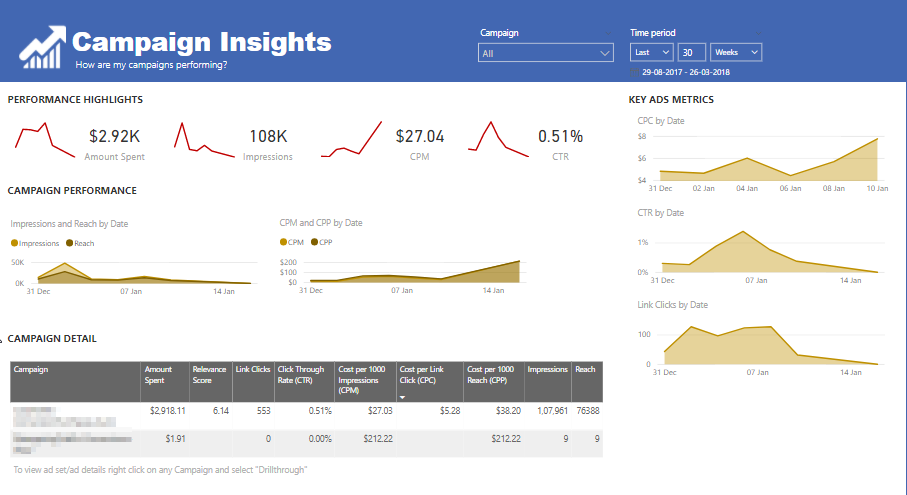
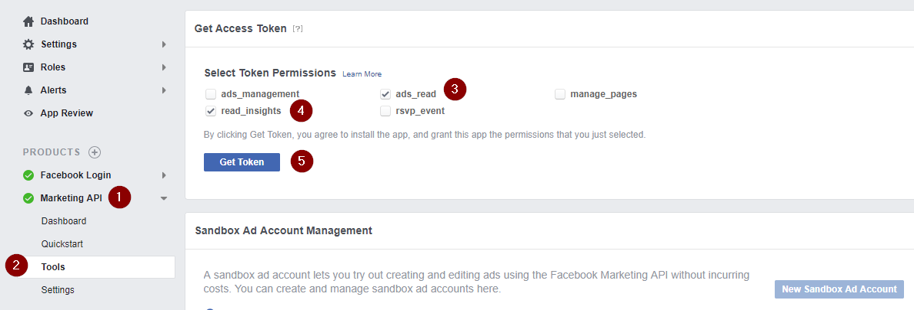
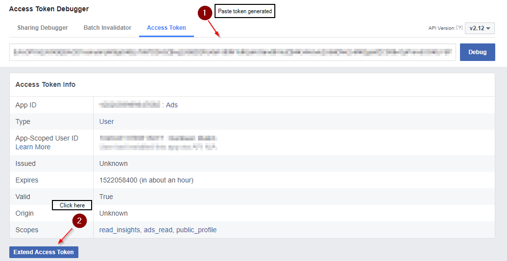

# Facebook marketing API Power BI Template

A simple to use Power BI Template file for Facebook Marketing/Ads API. It requires two inputs

1. Ad Account ID
2. Access token

Other inputs are optional and have default value set. 

The template file has a data model and two report pages which shows your campaign insights.

Features:
1. Pulls data from Facebook Marketing API for last_30d or last_90d AND today (by default last_30d or last_90d does not include today)
2. Pulls data for Archived Ads as well for above mentioned periods (by default data for archived ads are not included)

Date model:

Campaign Insight Report page:

## How to get Ad Account ID?

1. Login to your Facebook account. 
2. From top right drop down select create ads. You will now directed towards Facebook ads manager page. 
3. Click settings 

You'll now see your account id.

## How to get Access token?

1. Create an app in Facebook
2. Enable Marketing API
3. Get Token with permissions ads_read, read_insights. This token is valid for 90 minutes.

4. Go to Settings->advanced, add the current ad account to the API and save changes

Extend the token

1. Go to https://developers.facebook.com/tools/debug/accesstoken
2. Copy the token generated and click "Extend Token", and follow along

3. The token now generated is valid for 2 months
Note: If you face any issues in using this please open up an issue in the tracker for me to check and respond.

Thanks

