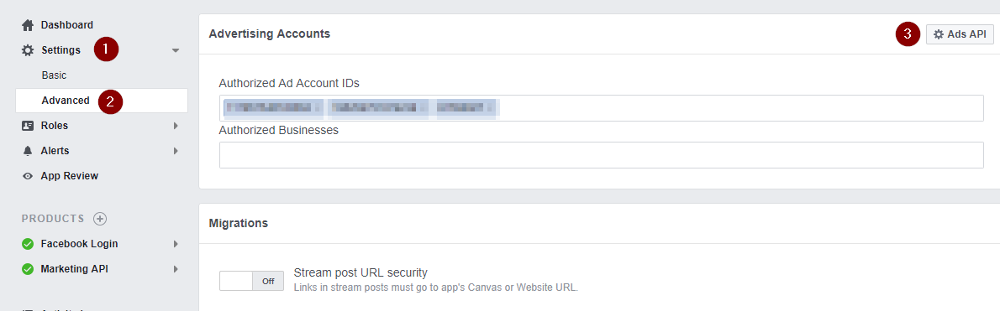

# Facebook Marketing API Power BI Template

This template has been moved to my website: https://t.co/keZQe3FFmL

A simple to use Power BI Template file for Facebook Marketing/Ads API for analysing campaign performance at campaign, ad set and ad levels. The template requires two inputs:

1. Ad Account ID
2. Access token

Other inputs are optional and have default value set. 

The template file has a data model and one report page which shows your campaign insights.

Features:
1. Pulls data from Facebook Marketing API for last_30d or last_90d AND today (by default last_30d or last_90d does not include today)
2. Pulls data for Archived Ads as well for above mentioned periods (by default data for archived ads are not included)
3. You can publish this to PowerBI.com, setup daily or hourly refreshes and view your campaign insights!

## How to get Ad Account ID?

1. Login to your Facebook account. 
2. From top right drop down select create ads. You will now directed towards Facebook ads manager page. 
3. Click settings 

You'll now see your Ad Account ID.

## How to get Access token?

1. Create an app in Facebook
2. Enable Marketing API
3. Get Token with permissions ads_read, read_insights. This token is valid for 90 minutes.

4. Go to App Settings->advanced, add the current ad account to the API and save changes

Extend the token

1. Go to https://developers.facebook.com/tools/debug/accesstoken
2. Copy the token generated in step 3 above, and click "Extend Token", and follow along

3. The token now generated is valid for 2 months

## Troubleshooting

1. Check if your token is valid or not
2. If 500 error comes, get data for last_30d. If using that also you get error, get data with "reporting granularity" as 2 or 5 and then retry. In most cases it works fine.

Note: If you face any other issues in using this please open up an issue in the tracker for me to check and respond.

Thanks

